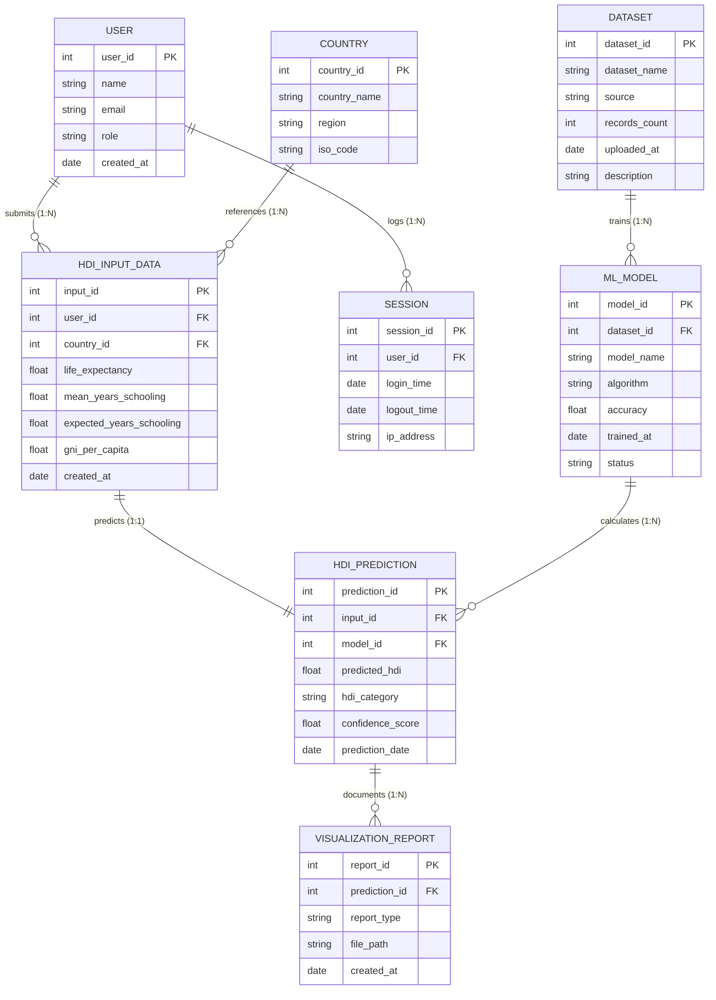

# Entity Relationship Diagram

## Task Overview

This task focuses on designing the **Entity Relationship (ER) Diagram** for the **A Comprehensive Measure of Well-Being (HDI Prediction System)**. The ER diagram provides a conceptual representation of the database by identifying the major entities, their attributes, primary keys, foreign keys, and relationships.

The diagram serves as the foundation for database design and application development by illustrating how information flows throughout the HDI prediction system.

---

# Objective

* Design the database structure for the HDI Prediction System.
* Identify all major entities involved in the application.
* Define primary keys and foreign keys.
* Represent relationships between entities.
* Improve database consistency and maintainability.

---

# Entity Relationship Diagram (ERD)

---

# Entities Description

## 1. User
Stores information about users accessing the application.
* **user_id (Primary Key):** Unique user identifier.
* **name:** Full name.
* **email:** Security login identifier.
* **role:** Access level role (e.g. Researcher, Admin, Guest).
* **created_at:** Registration date timestamp.

## 2. Country
Contains country information used for regional HDI prediction tracking.
* **country_id (Primary Key):** Unique identifier.
* **country_name:** Official country name.
* **region:** Continent/geographic region.
* **iso_code:** International standard ISO country code.

## 3. HDI Input Data
Stores the parameter variables entered for prediction.
* **input_id (Primary Key):** Unique query input ID.
* **user_id (Foreign Key):** Maps to `User.user_id`.
* **country_id (Foreign Key):** Maps to `Country.country_id`.
* **life_expectancy:** Health indicator continuous value.
* **mean_years_schooling:** Education indicator continuous value.
* **expected_years_schooling:** Education indicator continuous value.
* **gni_per_capita:** Standard of living continuous value.
* **created_at:** Entry creation timestamp.

## 4. ML Model
Stores machine learning model information.
* **model_id (Primary Key):** Unique model record ID.
* **dataset_id (Foreign Key):** Maps to `Dataset.dataset_id`.
* **model_name:** Model version name.
* **algorithm:** Class method (e.g. Linear Regression, Ridge).
* **accuracy:** Testing R2 score accuracy.
* **trained_at:** Export date timestamp.
* **status:** Current status (e.g., Active, Archived).

## 5. HDI Prediction
Stores prediction results generated by the trained model.
* **prediction_id (Primary Key):** Unique prediction ID.
* **input_id (Foreign Key):** Maps to `HDI_Input_Data.input_id`.
* **model_id (Foreign Key):** Maps to `ML_Model.model_id`.
* **predicted_hdi:** Predicted continuous HDI score (0 to 1).
* **hdi_category:** Classification category (Low, Medium, High, Very High).
* **confidence_score:** Model prediction confidence score.
* **prediction_date:** Prediction timestamp.

## 6. Dataset
Contains information about the dataset used for model training.
* **dataset_id (Primary Key):** Unique dataset ID.
* **dataset_name:** Filename or version code.
* **source:** Source publisher URL.
* **records_count:** Number of rows in training file.
* **uploaded_at:** Dataset upload timestamp.
* **description:** Optional summary info.

## 7. Visualization Report
Stores generated charts and analytical reports.
* **report_id (Primary Key):** Unique report record ID.
* **prediction_id (Foreign Key):** Maps to `HDI_Prediction.prediction_id`.
* **report_type:** Format/Type of report (e.g. PDF, Image Chart).
* **file_path:** Local directory path of report file.
* **created_at:** Generation timestamp.

## 8. Session
Maintains user login sessions.
* **session_id (Primary Key):** Unique session key.
* **user_id (Foreign Key):** Maps to `User.user_id`.
* **login_time:** Session start timestamp.
* **logout_time:** Session termination timestamp.
* **ip_address:** IP address of access user.

---

# Relationships Mapping

| Parent Entity | Child Entity | Relationship | Primary Key | Foreign Key |
| :--- | :--- | :--- | :--- | :--- |
| **User** | HDI Input Data | One-to-Many (1:N) | `user_id` | `HDI_Input_Data.user_id` |
| **Country** | HDI Input Data | One-to-Many (1:N) | `country_id` | `HDI_Input_Data.country_id` |
| **HDI Input Data**| HDI Prediction | One-to-One (1:1) | `input_id` | `HDI_Prediction.input_id` |
| **ML Model** | HDI Prediction | One-to-Many (1:N) | `model_id` | `HDI_Prediction.model_id` |
| **HDI Prediction**| Visualization Report| One-to-Many (1:N) | `prediction_id`| `Visualization_Report.prediction_id`|
| **Dataset** | ML Model | One-to-Many (1:N) | `dataset_id` | `ML_Model.dataset_id` |
| **User** | Session | One-to-Many (1:N) | `user_id` | `Session.user_id` |

---

# ER Diagram Description

The ER diagram demonstrates how users submit HDI input values for a selected country. These values are processed by a trained machine learning model to generate HDI predictions. Each prediction can produce multiple visualization reports. The machine learning model is trained using the dataset, while user sessions are maintained separately for application tracking.

---

# Advantages

* **Provides a clear database structure:** Visually layouts data organization.
* **Eliminates redundancy:** Isolates entities to prevent duplication.
* **Improves data integrity:** Foreign key constraints prevent orphan records.
* **Simplifies future maintenance:** Clean modular schemas allow easy structural updates.
* **Supports efficient database implementation:** Directly maps to SQL schema DDL.
* **Helps developers understand system architecture:** Quick reference blueprint.

---

# Expected Outcome

A well-structured ER Diagram that accurately represents all entities, attributes, keys, and relationships within the HDI Prediction System.

---

# Result

Successfully designed the Entity Relationship Diagram for the HDI Prediction System, representing all major entities, relationships, primary keys, and foreign keys required for efficient database management.

---

# Conclusion

The ER Diagram acts as the blueprint of the HDI Prediction System. It clearly defines how users, datasets, machine learning models, prediction results, countries, reports, and sessions are interconnected. This structured design supports scalable application development, improves database organization, and ensures reliable management of prediction-related data.
