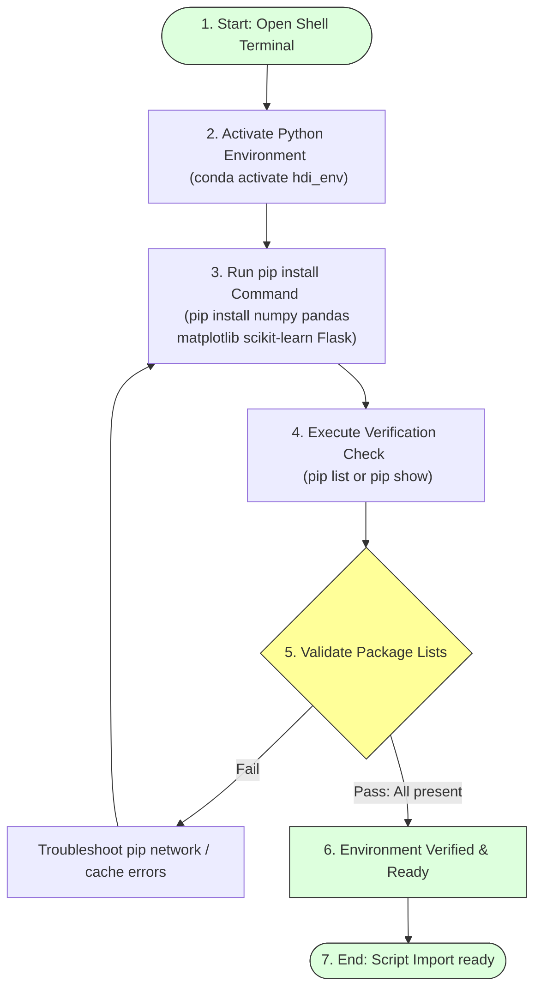

# Download Required Packages

## Task Overview

The first step in developing the **A Comprehensive Measure of Well-Being (HDI Prediction System)** is to configure the Python development environment by installing all the required libraries and dependencies. These packages provide the functionality needed for data preprocessing, visualization, machine learning model development, and deployment of the Flask web application.

Installing the required packages before starting development ensures compatibility among libraries, minimizes dependency-related issues, and enables smooth execution of the project.

---

# Objective

* Set up the Python development environment.
* Install all required libraries for machine learning and web development.
* Prepare the system for data analysis, model training, and deployment.
* Verify successful installation of all dependencies.

---

# Package Installation & Verification Pipeline



---

# Software Requirements

* **IDE:** Visual Studio Code (or PyCharm)
* **Runtime:** Python 3.x
* **Package Manager:** `pip` (Python Package Manager)

---

# Required Python Libraries

## 1. NumPy
NumPy is a fundamental Python library for numerical computing. It provides support for multi-dimensional arrays, matrices, and mathematical operations required for machine learning.
* **Installation:**
  ```bash
  pip install numpy
  ```
* **Purpose:**
  * Numerical computations
  * Array manipulation
  * Mathematical operations
  * Matrix calculations

---

## 2. Pandas
Pandas is a powerful data analysis library used to load, clean, transform, and manipulate structured datasets.
* **Installation:**
  ```bash
  pip install pandas
  ```
* **Purpose:**
  * Read CSV files
  * Handle missing values
  * Data preprocessing
  * DataFrame operations

---

## 3. Matplotlib
Matplotlib is a visualization library used to generate graphs and charts for exploratory data analysis.
* **Installation:**
  ```bash
  pip install matplotlib
  ```
* **Purpose:**
  * Scatter plots
  * Histograms
  * Line charts
  * Data visualization

---

## 4. Scikit-learn
Scikit-learn is a comprehensive machine learning library that provides algorithms for regression, classification, clustering, preprocessing, and model evaluation.
* **Installation:**
  ```bash
  pip install scikit-learn
  ```
* **Purpose:**
  * Linear Regression
  * Train-Test Split
  * Model evaluation
  * Data preprocessing

---

## 5. Flask
Flask is a lightweight Python web framework used to deploy the trained machine learning model through a web interface.
* **Installation:**
  ```bash
  pip install Flask
  ```
* **Purpose:**
  * Backend development
  * Routing
  * Model integration
  * User request handling

---

# Installing All Packages Together

For efficiency, all required libraries can be installed using a single command block:

```bash
pip install numpy pandas matplotlib scikit-learn Flask
```

---

# Verify Installed Packages

To confirm that all packages have been installed successfully, execute the list check in your command terminal:

```bash
pip list
```

The installed libraries should appear in the packages index list with their respective version codes.

---

# Development Environment

* **IDE:** Visual Studio Code / PyCharm
* **Language:** Python 3.x
* **Package Manager:** pip
* **Operating System:** Windows / Linux / macOS

---

# Expected Outcome

A fully configured Python environment with all required libraries installed successfully, enabling seamless implementation of the HDI Prediction System.

---

# Result

All required Python libraries were successfully installed using the pip package manager. The development environment is now ready for dataset processing, machine learning model development, visualization, and Flask web application deployment.

---

# Conclusion

Installing the required packages is a crucial initial step in the machine learning workflow. With the development environment properly configured, the project is prepared for efficient data analysis, model training, evaluation, and deployment without dependency-related issues.
