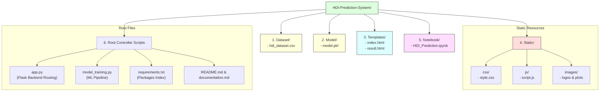

# Set Up Folder Structure

## Task Overview

A well-organized folder structure is essential for developing a scalable and maintainable machine learning project. In this task, the project directories are created to separate datasets, source code, machine learning models, templates, static assets, and other resources. Organizing files systematically improves project readability, simplifies debugging, and prevents path-related issues during development and deployment.

The folder structure serves as the foundation of the **A Comprehensive Measure of Well-Being (HDI Prediction System)** and ensures that all project components are stored in appropriate locations.

---

# Objective

* Create the complete project directory structure.
* Organize project files into dedicated folders.
* Improve project maintainability and readability.
* Prevent file path and resource management issues.
* Prepare the project for machine learning development and Flask deployment.

---

# Project Directory Tree Diagram



---

# Project Folder Structure

```
HDI-Prediction-System/
│
├── Dataset/
│   └── hdi_dataset.csv
│
├── Model/
│   └── model.pkl
│
├── Templates/
│   ├── index.html
│   └── result.html
│
├── Static/
│   ├── css/
│   │   └── style.css
│   ├── js/
│   │   └── script.js
│   └── images/
│
├── Notebook/
│   └── HDI_Prediction.ipynb
│
├── app.py
├── model_training.py
├── requirements.txt
├── README.md
└── documentation.md
```

---

# Folder Description

## Dataset/
Stores the dataset used for training and testing the machine learning model.
* **Contents:**
  * HDI dataset (`hdi_dataset.csv`)

## Model/
Contains the trained machine learning model saved using Pickle.
* **Contents:**
  * `model.pkl`

## Templates/
Stores HTML pages used by the Flask application.
* **Contents:**
  * Home page
  * Prediction page
  * Result page

## Static/
Contains all static resources used by the web application.
* **css/**: Stores Cascading Style Sheets (`style.css`).
* **js/**: Stores JavaScript files (`script.js`).
* **images/**: Stores logos, icons, and project images.

## Notebook/
Contains Jupyter Notebook files used during model development and experimentation (`HDI_Prediction.ipynb`).

## app.py
Main Flask application responsible for:
* Loading the trained model
* Handling user requests
* Generating predictions
* Displaying results

## model_training.py
Contains the machine learning workflow, including:
* Data loading
* Data preprocessing
* Model training
* Model evaluation
* Model saving

## requirements.txt
Lists all Python dependencies required to run the project.
```
numpy
pandas
matplotlib
scikit-learn
Flask
```

## README.md
Provides an overview of the project, installation instructions, and usage information.

## documentation.md
Contains detailed documentation for each project task.

---

# Benefits of Proper Folder Organization

* **Easy project navigation:** Developers can quickly locate assets.
* **Improved code maintainability:** Modular division prevents bloated files.
* **Better collaboration among developers:** Predictable directory conventions simplify integration.
* **Simplified debugging:** Isolates errors to specific components (e.g. styling vs. model logic).
* **Reduced file management errors:** Prevents absolute directory path broken references.
* **Easier deployment and scalability:** Dockerization and deployment packaging are standardized.

---

# Best Practices Followed

* Separate source code from datasets.
* Store trained models in a dedicated folder.
* Keep HTML templates separate from static resources.
* Organize CSS, JavaScript, and images independently.
* Maintain project documentation in the root directory.

---

# Expected Outcome

A clean and organized project structure where every file is stored in its appropriate directory, ensuring efficient project development and smooth execution.

---

# Result

The complete folder structure for the HDI Prediction System was successfully created. All project files were organized into dedicated directories, enabling efficient resource management, easy navigation, and scalable application development.

---

# Conclusion

Establishing a proper folder structure is an important step in software and machine learning development. A well-organized project architecture improves maintainability, reduces development complexity, and supports seamless integration of datasets, machine learning models, Flask components, and documentation.
