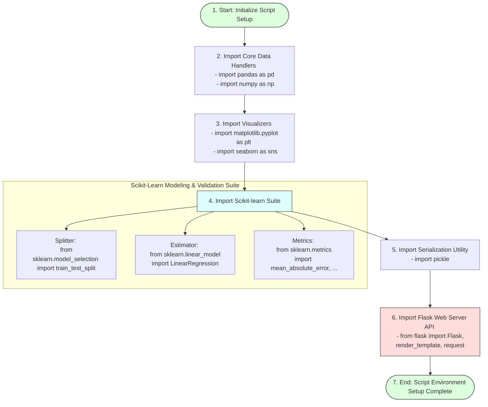

# Required Libraries Install and Import

## Task Overview

Before starting data analysis and machine learning model development, all required Python libraries must be imported into the project. These libraries provide the necessary functions for data manipulation, numerical computation, visualization, and model building. Importing them at the beginning of the program ensures a clean workflow and makes the code easier to maintain and understand.

In the **HDI Prediction System**, libraries such as NumPy, Pandas, Matplotlib, Seaborn, and Scikit-learn are used throughout the project for preprocessing data, creating visualizations, training the Linear Regression model, and evaluating its performance.

---

# Objective

* Import all required Python libraries.
* Prepare the development environment for data analysis.
* Enable visualization and machine learning functionalities.
* Improve code readability and maintainability.

---

# Libraries Import & Setup Schema



---

# Libraries Used

## 1. NumPy
NumPy is the core library for numerical computing in Python. It supports multi-dimensional arrays and mathematical operations.
* **Import Statement:**
  ```python
  import numpy as np
  ```
* **Purpose:**
  * Numerical calculations
  * Array operations
  * Mathematical computations

---

## 2. Pandas
Pandas is used to read, organize, clean, and manipulate datasets.
* **Import Statement:**
  ```python
  import pandas as pd
  ```
* **Purpose:**
  * Load CSV datasets
  * Data cleaning
  * Data preprocessing
  * DataFrame operations

---

## 3. Matplotlib
Matplotlib provides plotting functions for visualizing data.
* **Import Statement:**
  ```python
  import matplotlib.pyplot as plt
  ```
* **Purpose:**
  * Histograms
  * Scatter plots
  * Line charts
  * Data visualization

---

## 4. Seaborn
Seaborn is built on Matplotlib and provides advanced statistical visualizations.
* **Import Statement:**
  ```python
  import seaborn as sns
  ```
* **Purpose:**
  * Heatmaps
  * Pair plots
  * Distribution plots
  * Correlation analysis

---

## 5. Additional Libraries
The following libraries are imported for machine learning and model deployment:

```python
from sklearn.model_selection import train_test_split
from sklearn.linear_model import LinearRegression
from sklearn.metrics import mean_absolute_error, mean_squared_error, r2_score
import pickle
from flask import Flask, render_template, request
```

### Purpose:
* **`train_test_split`:** Splits the dataset into training and testing sets.
* **`LinearRegression`:** Trains the Linear Regression model.
* **`mean_absolute_error`, `mean_squared_error`, `r2_score`:** Evaluates model performance.
* **`pickle`:** Saves the trained model to a serialized `.pkl` binary file.
* **`Flask`, `render_template`, `request`:** Builds the Flask web application backend and parses HTTP routing values.

---

# Complete Import Statements Block

```python
# Core Data Processing Libraries
import numpy as np
import pandas as pd

# Visualization Libraries
import matplotlib.pyplot as plt
import seaborn as sns

# Machine Learning Modules
from sklearn.model_selection import train_test_split
from sklearn.linear_model import LinearRegression
from sklearn.metrics import mean_absolute_error, mean_squared_error, r2_score

# Model Serialization Utility
import pickle

# Web Application Framework
from flask import Flask, render_template, request
```

---

# Benefits of Importing Libraries

* Simplifies code organization.
* Provides ready-to-use functions.
* Supports efficient data processing.
* Enables machine learning implementation.
* Facilitates data visualization.
* Improves code readability and debugging.

---

# Expected Outcome

All required Python libraries are successfully imported without errors, preparing the environment for data exploration, preprocessing, model training, evaluation, and deployment.

---

# Result

Successfully imported all necessary libraries required for the HDI Prediction System. The development environment is now fully prepared for the subsequent stages of the machine learning workflow.

---

# Conclusion

Importing the required libraries is a foundational step in any machine learning project. These libraries provide essential tools for data handling, visualization, model development, evaluation, and deployment, enabling an efficient and organized development process.
