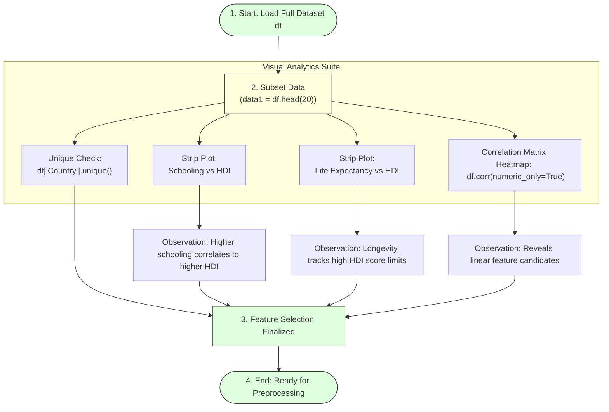

# Data Visualization

## Task Overview

Data visualization is an important step in Exploratory Data Analysis (EDA) that helps understand patterns, trends, and relationships within the dataset. In the **HDI Prediction System**, visualization is used to analyze how important human development indicators such as **Mean Years of Schooling**, **Life Expectancy**, and other socio-economic variables influence the Human Development Index (HDI).

To keep the graphs readable and avoid overcrowding, the first **20 records** of the dataset are selected and stored in a new DataFrame named **data1**. Various visualizations are then created using **Matplotlib** and **Seaborn**.

---

# Objective

* Explore the dataset visually.
* Identify relationships between features and HDI.
* Detect patterns and trends.
* Analyze feature correlations.
* Select relevant features for machine learning.

---

# Data Visualization Pipeline



---

# Libraries Used

```python
import matplotlib.pyplot as plt
import seaborn as sns
```

---

# Preparing Data for Visualization

To improve graph readability and prevent chart overcrowding, the first 20 rows of the dataset are selected for individual plot distributions:

```python
# Extract top 20 rows
data1 = df.head(20)
```

---

# Visualizations Catalog

## 1. Unique Country Values
* **Purpose:** Identify all unique countries in the dataset and verify that no duplicate country names exist.
* **Code:**
  ```python
  df["Country"].unique()
  ```
* **Outcome:**
  * Displays all unique country names.
  * Confirms data consistency.
  * Verifies that each country is uniquely represented.

---

## 2. Mean Years of Schooling vs HDI
* **Purpose:** Analyze how the average years of schooling influence the Human Development Index.
* **Code:**
  ```python
  plt.figure(figsize=(10, 6))
  sns.stripplot(
      x=data1["Mean Years of Schooling"],
      y=data1["HDI"],
      size=8,
      color='blue'
  )
  plt.title("Mean Years of Schooling vs HDI Score")
  plt.xlabel("Mean Years of Schooling")
  plt.ylabel("HDI Score")
  plt.tight_layout()
  plt.show()
  ```
* **Observation:** Countries with higher mean years of schooling generally have higher HDI values. Education is a strong contributor to human development.

---

## 3. Life Expectancy vs HDI
* **Purpose:** Examine the relationship between life expectancy and HDI.
* **Code:**
  ```python
  plt.figure(figsize=(10, 6))
  sns.stripplot(
      x=data1["Life Expectancy"],
      y=data1["HDI"],
      size=8,
      color='green'
  )
  plt.title("Life Expectancy vs HDI Score")
  plt.xlabel("Life Expectancy (Years)")
  plt.ylabel("HDI Score")
  plt.tight_layout()
  plt.show()
  ```
* **Observation:** Higher life expectancy is associated with higher HDI. Countries with longer average lifespans tend to achieve better human development outcomes.

---

## 4. Correlation Heatmap
* **Purpose:** Identify relationships among numerical variables using a correlation matrix.
* **Code:**
  ```python
  plt.figure(figsize=(12, 8))
  # Plot correlation matrix heatmap
  sns.heatmap(
      df.corr(numeric_only=True),
      annot=True,
      cmap="coolwarm",
      fmt=".2f"
  )
  plt.title("Feature Correlation Heatmap")
  plt.tight_layout()
  plt.show()
  ```
* **Observation:** Displays correlation coefficients between numerical features. Features with a strong positive correlation to HDI are ideal candidates for linear model training. Helps eliminate weak or redundant variables.

---

# Importance of Data Visualization

* Understands feature relationships.
* Detects hidden patterns.
* Identifies important predictors.
* Supports feature selection.
* Improves model accuracy.
* Simplifies exploratory data analysis.

---

# Expected Outcome

Visualizations clearly illustrate how education, life expectancy, and other human development indicators influence the HDI score. The correlation heatmap assists in selecting the most relevant features for machine learning.

---

# Result

Successfully generated visualizations using the first 20 dataset records. The plots demonstrated meaningful relationships between key indicators and HDI, while the correlation heatmap highlighted the strongest predictive features for model development.

---

# Conclusion

Data visualization provides valuable insights into the Human Development Index dataset by revealing trends and correlations among variables. These findings support informed feature selection, improve understanding of the data, and contribute to building an accurate Linear Regression model for HDI prediction.
