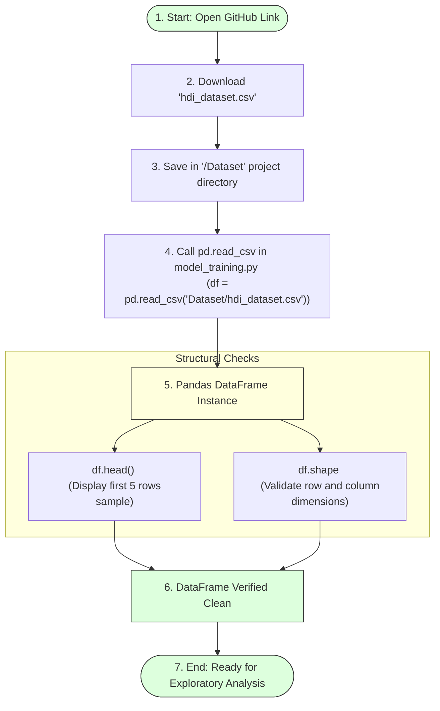

# Reading the Dataset

## Task Overview

The first step in building the **A Comprehensive Measure of Well-Being (HDI Prediction System)** is to obtain and load the dataset into the Python environment. The dataset used for this project is sourced from the **Human Development Index (HDI)** dataset available on GitHub. It contains socio-economic indicators such as life expectancy, education, and Gross National Income (GNI) per capita, which are used to predict the Human Development Index (HDI).

After downloading the dataset, it is placed in the project's `Dataset` folder and loaded into a Pandas DataFrame for further preprocessing and analysis.

---

# Objective

* Download the HDI dataset from the provided source.
* Store the dataset in the project directory.
* Read the dataset using the Pandas library.
* Verify that the dataset has been loaded successfully.
* Prepare the data for exploration and preprocessing.

---

# Dataset Importation & Dimension Check Flow



---

# Dataset Source

* **Dataset Name:** Human Development Index (HDI) Dataset
* **Source:** GitHub (Guided Projects Repository)
* **Dataset Link:** https://github.com/Guided-Projects/HumanDevelopmentIndex/tree/main/Dataset

---

# Steps Performed

### Step 1: Download the Dataset
Download the dataset from the provided GitHub repository and save it in the project's `Dataset` folder.

Example:
```
HDI-Prediction-System/
│
├── Dataset/
│   └── hdi_dataset.csv
```

---

### Step 2: Import Pandas
```python
import pandas as pd
```

---

### Step 3: Read the Dataset
```python
# Load the dataset CSV into a Pandas DataFrame
df = pd.read_csv("Dataset/hdi_dataset.csv")
```

---

### Step 4: Display the First Few Records
```python
# Display first 5 rows to review structure
df.head()
```
This command displays the first five rows of the dataset to verify that it has been loaded correctly.

---

### Step 5: Check Dataset Dimensions
```python
# Check row/column sizes
print("Dataset dimensions:", df.shape)
```
This returns the number of rows and columns in the dataset.

---

# Purpose of Reading the Dataset

* Load data into active memory.
* Verify successful data import.
* Prepare the dataset for analysis.
* Enable preprocessing and visualization.
* Provide input for machine learning model development.

---

# Expected Outcome

The HDI dataset is successfully loaded into a Pandas DataFrame, making it available for data exploration, preprocessing, and model training.

---

# Result

The Human Development Index dataset was successfully downloaded, stored in the project directory, and loaded into the Python environment using Pandas. The dataset is now ready for further analysis and preprocessing.

---

# Conclusion

Reading the dataset is a fundamental step in the machine learning workflow. Successfully loading the HDI dataset ensures that the project can proceed with data understanding, visualization, preprocessing, and model development using accurate and structured data.
