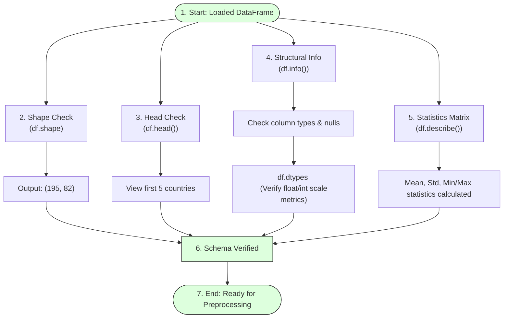

# Understanding the Dataset

## Task Overview

After successfully loading the Human Development Index (HDI) dataset, the next step is to understand its structure, contents, and overall characteristics. Dataset understanding is an important phase of the machine learning workflow because it helps identify the available features, target variables, data types, and potential data quality issues before preprocessing and model development.

The dataset is stored in CSV format and contains **195 records (countries)** and **82 features (human development indicators)**. Each row represents a country, while each column contains a specific socio-economic or human development metric.

---

# Objective

* Load the dataset into a Pandas DataFrame.
* Examine the dataset structure.
* Display sample records.
* Identify the number of rows and columns.
* Understand feature names and data types.
* Prepare the dataset for preprocessing and analysis.

---

# Data Structural Check Pipeline



---

# Dataset Information

| Property | Value |
|----------|-------|
| **Dataset Format** | CSV |
| **Number of Rows** | 195 |
| **Number of Columns** | 82 |
| **Each Row Represents** | A Country |
| **Each Column Represents** | A Human Development Indicator |

---

# Steps Performed

## Step 1: Load the Dataset

```python
import pandas as pd

# Load dataset to memory
df = pd.read_csv("Dataset/hdi_dataset.csv")
```

---

## Step 2: Display the First Five Records

```python
# Check top rows layout
df.head()
```

The `head()` method displays the first five rows of the dataset, allowing a quick inspection of the available features and their corresponding values.

---

## Step 3: Check Dataset Dimensions

```python
# Inspect dimensions
df.shape
```

**Expected Output**
```python
(195, 82)
```

This indicates that the dataset contains:
* **195 rows (countries)**
* **82 columns (features)**

---

## Step 4: View Column Names

```python
# Print feature labels
df.columns
```

This displays the names of all features available in the dataset.

---

## Step 5: Inspect Data Types

```python
# Check features formats
df.dtypes
```

This identifies whether each feature is numeric, categorical, or text-based.

---

## Step 6: Display Dataset Information

```python
# Check non-null distribution details
df.info()
```

The `info()` method provides:
* Number of entries
* Column names
* Data types
* Non-null values
* Memory usage

---

## Step 7: Generate Statistical Summary

```python
# Compute summary statistics
df.describe()
```

This provides descriptive statistics such as:
* Mean
* Median
* Standard Deviation
* Minimum
* Maximum
* Quartiles
for all numerical features.

---

# Importance of Dataset Understanding

* Identifies the dataset structure.
* Detects missing values.
* Understands feature distributions.
* Helps select relevant variables.
* Guides preprocessing techniques.
* Improves model development.

---

# Expected Outcome

The dataset is successfully inspected, revealing its dimensions, features, data types, and statistical properties. This understanding provides the foundation for preprocessing and machine learning model development.

---

# Result

The Human Development Index dataset was successfully explored using Pandas. The dataset contains **195 countries** and **82 human development indicators**, and its structure, columns, and data types were examined to prepare for subsequent preprocessing and analysis.

---

# Conclusion

Understanding the dataset is a critical step in the machine learning pipeline. By examining the dataset's structure, dimensions, and feature information, developers gain valuable insights that support effective preprocessing, feature selection, and accurate HDI prediction model development.
