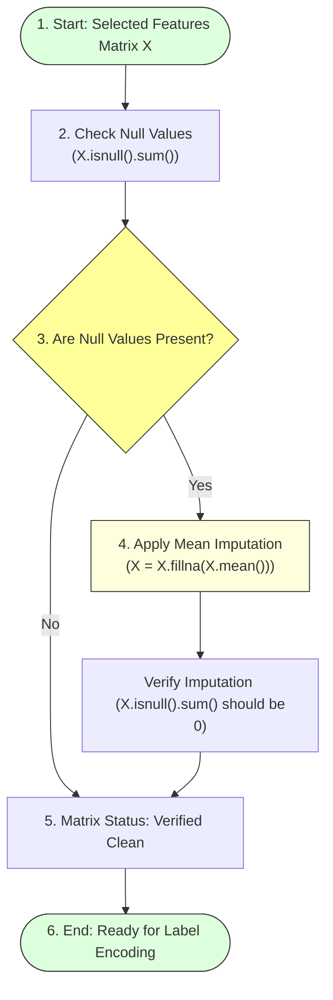

# Checking and Handling Null Values

## Task Overview

Data preprocessing is a critical stage in machine learning, and one of the most important preprocessing tasks is identifying and handling missing (null) values. Missing values can negatively affect the performance and accuracy of a machine learning model if they are not addressed properly.

In the **A Comprehensive Measure of Well-Being (HDI Prediction System)**, the selected independent variables are examined for null values using the Pandas `isnull().sum()` function. Any missing values found are replaced with the **mean of the respective column**, ensuring that the dataset remains complete and suitable for training the Linear Regression model.

---

# Objective

* Detect missing values in the selected input features.
* Count the number of null values in each column.
* Replace missing values with the column mean.
* Improve dataset quality before model training.

---

# Preprocessing: Imputation Execution Flow



---

# Why Handle Null Values?

Missing values may:
* Reduce model accuracy.
* Cause errors during training.
* Produce biased predictions.
* Affect statistical analysis.
* Lead to incomplete learning by the model.

Replacing null values with the **mean** helps preserve the overall distribution of numerical data without significantly altering the dataset.

---

# Step 1: Check for Null Values

the `isnull().sum()` method is used to count the number of missing values in each feature.

### Python Code:
```python
# Check for missing values in features matrix X
X.isnull().sum()
```

### Example Output:
```
Country                        0
Life Expectancy                2
Expected Years of Schooling    1
Mean Years of Schooling        3
GNI Per Capita                 0
dtype: int64
```
This output indicates the number of null values present in each selected independent variable.

---

# Step 2: Fill Missing Values

After identifying missing values, they are replaced with the mean value of the corresponding column.

### Python Code:
```python
# Impute numerical features with mean values
X = X.fillna(X.mean())
```
This operation ensures that every missing value is substituted with the average of its respective feature.

---

# Step 3: Verify the Dataset

After filling missing values, the dataset is checked again.

### Python Code:
```python
# Re-run check to confirm all null counts are zero
X.isnull().sum()
```

### Expected Output:
```
Country                        0
Life Expectancy                0
Expected Years of Schooling    0
Mean Years of Schooling        0
GNI Per Capita                 0
dtype: int64
```
This confirms that all missing values have been successfully handled.

---

# Advantages of Mean Imputation

* **Simple and efficient:** Executed in one line of code.
* **Preserves dataset size:** Avoids dropping records, maintaining valuable row samples.
* **Prevents data loss:** Retains non-null observations in other columns.
* **Suitable for numerical features:** Normalizes continuous socio-economic metrics.
* **Model stability:** Keeps regression fit operations numerically stable.
* **Enables uninterrupted model training:** Avoids math execution crash.

---

# Expected Outcome

The independent variables are free from missing values, resulting in a clean dataset ready for train-test splitting and Linear Regression model development.

---

# Result

Null values in the selected input features were successfully identified and replaced with the respective column means. The cleaned dataset is complete and ready for further preprocessing and machine learning model training.

---

# Conclusion

Handling missing values is an essential preprocessing step that improves data quality and model reliability. By replacing null values with column means, the HDI dataset becomes consistent and suitable for developing an accurate and robust Linear Regression model.
