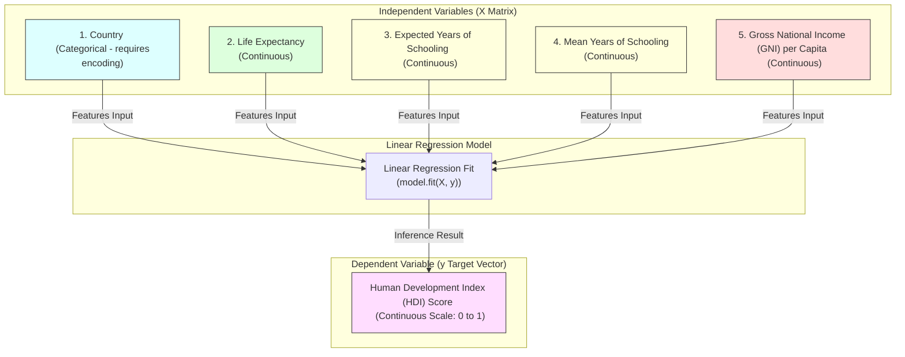

# Selecting Dependent and Independent Variables

## Task Overview

Feature selection is a crucial step in the machine learning pipeline. In this task, the dataset is divided into **independent variables (features)** and the **dependent variable (target)**. The independent variables provide the input information for the model, while the dependent variable represents the value that the model is trained to predict.

For the **A Comprehensive Measure of Well-Being (HDI Prediction System)**, the selected input features include important human development indicators such as **Country**, **Life Expectancy**, **Expected Years of Schooling**, **Mean Years of Schooling**, and **Gross National Income (GNI) per Capita**. The target variable is the **Human Development Index (HDI) Score**.

---

# Objective

* Identify the independent variables (X).
* Select the dependent variable (Y).
* Prepare the dataset for preprocessing and model training.
* Separate input features from the prediction target.

---

# Feature Selection Mapping Diagram



---

# Independent Variables (X)

The independent variables are the features used by the Linear Regression model to predict the HDI score. These variables include socio-economic indicators that influence human development.

**Examples of Features:**
* Country
* Life Expectancy
* Expected Years of Schooling
* Mean Years of Schooling
* Gross National Income (GNI) per Capita

These features are stored in the variable **X**.

### Python Code Example:
```python
# Select specific columns by index
X = df.iloc[:, [2, 5, 6, 7, 8]].values
```

> **Note:** Replace the column indices with those that match your dataset if they differ.

---

# Dependent Variable (Y)

The dependent variable is the target that the model learns to predict.

In this project, the target variable is:
* **Human Development Index (HDI) Score**

It is stored in the variable **Y**.

### Python Code Example:
```python
# Select the target HDI column by index
Y = df.iloc[:, 4].values
```

---

# Why Feature Selection is Important

* **Identifies relevant input variables:** Isolates the main contributors to well-being measurements.
* **Removes unnecessary columns:** Streamlines calculations by ignoring irrelevant headers.
* **Improves model performance:** Minimizes residual errors.
* **Reduces computational complexity:** Fits faster and uses less memory.
* **Prevents overfitting:** Stops models from fitting noise in secondary columns.
* **Simplifies model interpretation:** Makes slope weights easy to explain.

---

# Data Representation

```
Dataset
   │
   ├── Independent Variables (X)
   │      ├── Country
   │      ├── Life Expectancy
   │      ├── Expected Years of Schooling
   │      ├── Mean Years of Schooling
   │      └── GNI per Capita
   │
   └── Dependent Variable (Y)
          └── HDI Score
```

---

# Expected Outcome

The dataset is successfully divided into input features (**X**) and the target variable (**Y**), making it ready for preprocessing, train-test splitting, and machine learning model development.

---

# Result

The independent and dependent variables were successfully selected from the dataset. The input features were stored in **X**, while the HDI score was assigned to **Y**, preparing the dataset for the next stage of the machine learning workflow.

---

# Conclusion

Selecting appropriate independent and dependent variables is a fundamental step in machine learning. By separating the input features from the target variable, the dataset becomes ready for preprocessing and Linear Regression model training, enabling accurate prediction of the Human Development Index.
