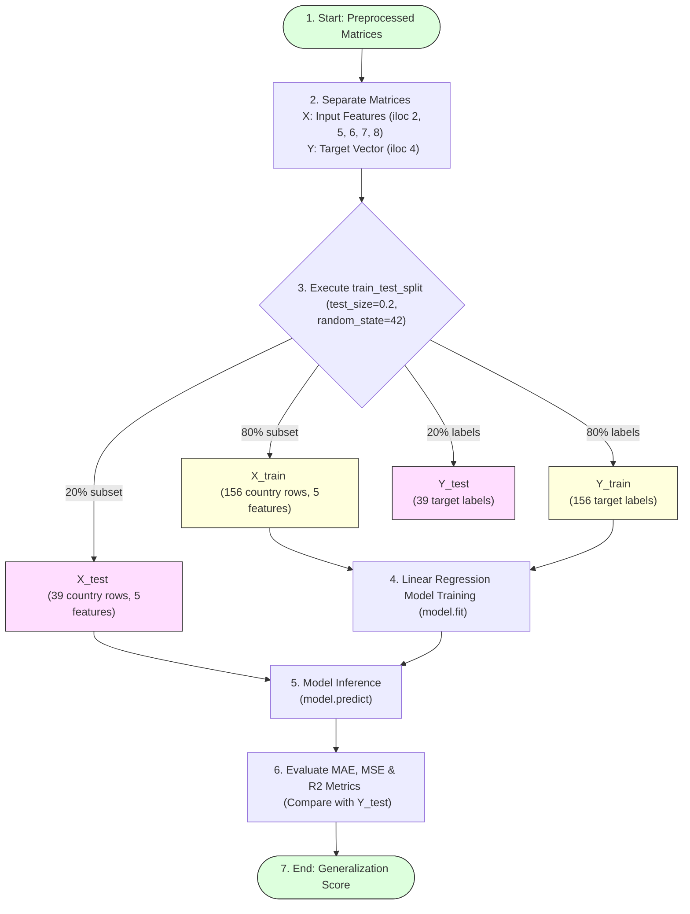

# Train and Test Data

## Task Overview

Splitting the dataset into **training** and **testing** sets is a fundamental step in the machine learning workflow. This process allows the model to learn patterns from one portion of the data (training set) and then evaluate its performance on previously unseen data (testing set).

For the **A Comprehensive Measure of Well-Being (HDI Prediction System)**, the processed dataset is divided using Scikit-learn's `train_test_split()` function. This helps assess the model's ability to generalize and ensures reliable prediction of the Human Development Index (HDI).

---

# Objective

* Split the dataset into training and testing sets.
* Train the model using the training data.
* Evaluate model performance using unseen testing data.
* Prevent overfitting and improve model generalization.

---

# Train-Test Split Partition Flow



---

# Why Train-Test Split?

Separating the dataset provides several benefits:
* Enables unbiased model evaluation.
* Prevents overfitting.
* Measures model performance on unseen data.
* Improves model reliability.
* Supports accurate performance analysis.

---

# Train-Test Split Implementation

The `train_test_split()` function from **Scikit-learn** is used to divide the dataset into training and testing subsets.

### Import Library
```python
from sklearn.model_selection import train_test_split
```

### Split the Dataset
```python
# Partition features and targets into 80% train and 20% test
X_train, X_test, Y_train, Y_test = train_test_split(
    X,
    Y,
    test_size=0.2,
    random_state=42
)
```

---

# Parameters Used

| Parameter | Description |
|-----------|-------------|
| **X** | Independent variables (input features matrix) |
| **Y** | Dependent variable (HDI Score target vector) |
| **test_size=0.2** | Allocates 20% of the dataset for testing |
| **random_state=42** | Ensures reproducible split results |

---

# Dataset Distribution

For a dataset containing **195 records**:

| Dataset Split | Percentage | Approximate Records Count |
| :--- | :--- | :--- |
| **Training Data** | 80% | 156 |
| **Testing Data** | 20% | 39 |

The exact numbers may vary depending on the dataset size.

---

# Output Variables

* `X_train` – Training input features
* `X_test` – Testing input features
* `Y_train` – Training target values
* `Y_test` – Testing target values

---

# Verify Dataset Shapes

```python
# Print shapes to verify split sizes
print("X_train shape:", X_train.shape)
print("X_test shape:", X_test.shape)
print("Y_train shape:", Y_train.shape)
print("Y_test shape:", Y_test.shape)
```
This confirms that the data has been split correctly.

---

# Workflow Summary

```
Clean Dataset
      │
      ▼
Independent Variables (X)
Dependent Variable (Y)
      │
      ▼
train_test_split()
      │
      ├──────────────┐
      ▼              ▼
Training Data    Testing Data
      │              │
      ▼              ▼
Model Training   Model Evaluation
```

---

# Expected Outcome

The dataset is successfully divided into training and testing subsets, allowing the Linear Regression model to learn from the training data and be evaluated on unseen testing data.

---

# Result

The HDI dataset was successfully split into training and testing sets using Scikit-learn's `train_test_split()` function. The resulting datasets are now ready for model training and performance evaluation.

---

# Conclusion

Dividing the dataset into training and testing subsets is a crucial step in building a reliable machine learning model. It enables objective evaluation, improves generalization, and helps ensure that the HDI prediction model performs effectively on unseen data.
