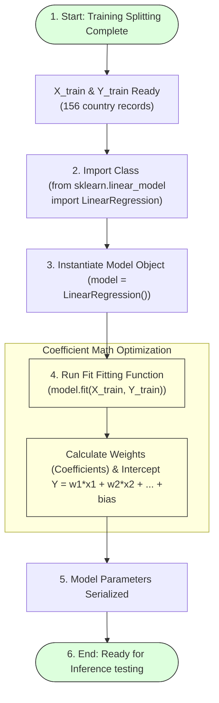

# Fit the Linear Regression Model

## Task Overview

After preprocessing the dataset and dividing it into training and testing sets, the next step is to train the machine learning model. In this project, a **Linear Regression** algorithm is used to learn the relationship between the selected human development indicators and the Human Development Index (HDI) score.

The model is trained using the training dataset (`X_train` and `Y_train`). During this process, the algorithm identifies patterns within the data and calculates the optimal coefficients that best describe the relationship between the input features and the target variable. Once training is complete, the model is ready to make predictions on unseen data.

---

# Objective

* Import the Linear Regression algorithm.
* Create a Linear Regression model.
* Train the model using the training dataset.
* Learn the relationship between input features and HDI.
* Prepare the trained model for prediction.

---

# Linear Regression Model Fitting Workflow



---

# Linear Regression

Linear Regression is a supervised machine learning algorithm used to predict continuous numerical values. It establishes a linear relationship between independent variables (features) and the dependent variable (HDI Score).

---

# Step 1: Import the Library

```python
from sklearn.linear_model import LinearRegression
```

---

# Step 2: Create the Model

```python
# Instantiate regression object
model = LinearRegression()
```
This creates an instance of the Linear Regression model.

---

# Step 3: Train the Model

```python
# Fit coefficients against training partition
model.fit(X_train, Y_train)
```
The `fit()` method trains the model using the training dataset.

---

# Step 4: Verify Model Training

After training, the model is ready to predict HDI values for new data.

Example:
```python
print("Model training completed successfully.")
```

---

# Model Training Workflow

```
Preprocessed Dataset
        │
        ▼
Train-Test Split
        │
        ▼
Training Dataset
(X_train, Y_train)
        │
        ▼
Linear Regression
        │
        ▼
Model.fit()
        │
        ▼
Trained Model
```

---

# Benefits of Linear Regression

* **Simple and efficient algorithm:** Low computational complexity.
* **Easy to interpret:** Feature coefficients directly correspond to slopes.
* **Suitable for continuous value prediction:** Maps continuous socio-economic metrics onto continuous output HDI values.
* **Fast model training:** Fits instantaneously.
* **Good baseline regression model:** Establishes standard reference metric bounds.
* **Works well for HDI prediction:** High linear correlation exists with life expectancy and school indexes.

---

# Expected Outcome

The Linear Regression model is successfully trained using the training dataset and is ready to generate predictions for unseen data.

---

# Result

The Linear Regression model was successfully imported, instantiated, and trained using the prepared training dataset. The trained model learned the relationship between the selected human development indicators and the HDI score, making it ready for prediction and evaluation.

---

# Conclusion

Training the Linear Regression model is a key stage in the machine learning pipeline. By fitting the model to the training data, it learns the underlying relationships between the input variables and the HDI score, enabling accurate predictions for new data.
