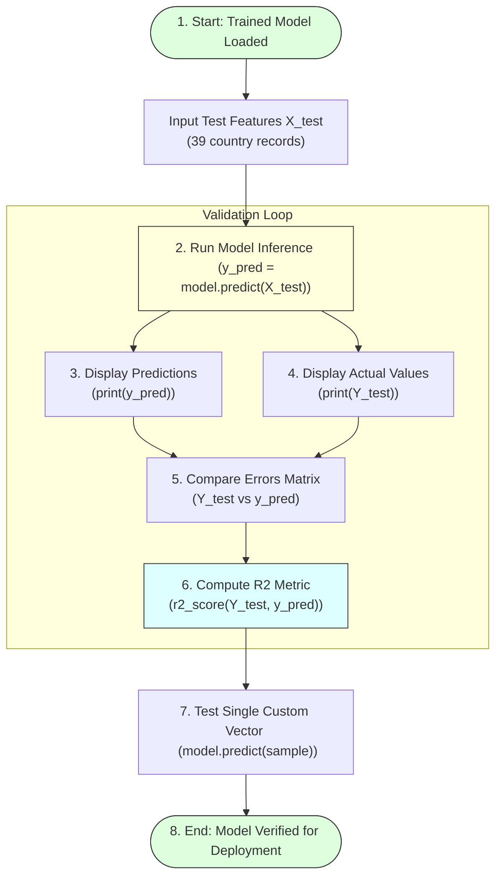

# Predicting the Results

## Task Overview

Once the Linear Regression model has been trained, the next step is to generate predictions using the testing dataset. The trained model is applied to the unseen test data (`X_test`) to estimate the corresponding Human Development Index (HDI) scores.

The predicted values are then compared with the actual HDI scores (`Y_test`) to evaluate the model's performance. The **R-Squared (R²) Score** is calculated to measure how well the model explains the variation in the target variable. Additionally, the model can be tested with a single or reduced set of input values to verify its prediction capability.

---

# Objective

* Generate HDI predictions using the testing dataset.
* Compare predicted values with actual values.
* Evaluate model performance using the R² score.
* Test the model with new input values.
* Validate prediction accuracy.

---

# Prediction & Inference Workflow



---

# Step 1: Generate Predictions

Use the trained Linear Regression model to predict HDI values.

### Python Code:
```python
# Predict targets for unseen features matrix
y_pred = model.predict(X_test)
```

---

# Step 2: Display Predicted Values

Print the predicted HDI scores.

### Python Code:
```python
# Print predicted values array
print(y_pred)
```

---

# Step 3: Display Actual Values

Print the actual HDI scores from the testing dataset.

### Python Code:
```python
# Print ground truth target values
print(Y_test)
```
This provides the ground truth values for comparison.

---

# Step 4: Compare Predictions

By comparing `Y_test` and `y_pred`, we can observe how closely the predicted values match the actual HDI scores.

Example comparison layout:

| Actual HDI | Predicted HDI | Deviation (Error) |
|:---|:---|:---|
| 0.912 | 0.908 | 0.004 |
| 0.845 | 0.849 | -0.004 |
| 0.721 | 0.718 | 0.003 |

Small differences indicate that the model performs well.

---

# Step 5: Calculate R-Squared Score

The R² score measures how well the independent variables explain the variation in the dependent variable.

### Python Code:
```python
from sklearn.metrics import r2_score

# Calculate R2 accuracy score
score = r2_score(Y_test, y_pred)
print("R-Squared (R2) Score:", score)
```

---

# Interpretation of R²

| R² Score Range | Quality Interpretation |
| :--- | :--- |
| **1.0** | Perfect prediction (overfitted or trivial) |
| **0.9 – 1.0** | Excellent model performance |
| **0.7 – 0.9** | Good performance |
| **0.5 – 0.7** | Moderate performance |
| **Below 0.5** | Poor performance |

A higher R² value indicates that the model predicts HDI scores more accurately.

---

# Step 6: Test with Individual Inputs

The trained model can also predict the HDI score for a new set of input values.

### Python Code:
```python
# Define custom query inputs vector:
# [country_encoded, life_expectancy, expected_schooling, mean_schooling, gni_per_capita]
sample = [[12, 75.5, 14.2, 10.5, 25000.0]]

# Predict single instance
prediction = model.predict(sample)
print("Custom single prediction HDI:", prediction[0])
```
This demonstrates the model's ability to make predictions for new data.

---

# Expected Outcome

The trained model successfully predicts HDI scores for unseen data. The predicted values closely match the actual values, and a high R² score indicates good predictive performance.

---

# Result

The Linear Regression model generated HDI predictions for the testing dataset. The predicted values closely matched the actual HDI scores, and the calculated R² score confirmed that the model effectively learned the relationship between the selected features and the target variable.

---

# Conclusion

Generating predictions and evaluating them using the R² score is an essential part of the machine learning workflow. The close agreement between predicted and actual HDI values demonstrates that the Linear Regression model performs reliably and is suitable for estimating Human Development Index scores based on key socio-economic indicators.
