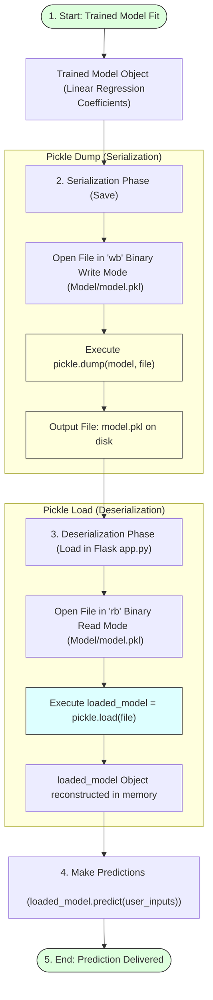

# Saving the Model

## Project Title

**A Comprehensive Measure of Well-Being (HDI Prediction System)**

---

# Objective

The objective of this task is to serialize the trained Linear Regression machine learning model and save it as a `.pkl` (Pickle) file. Saving the model allows the Flask web application to load the trained parameters directly, enabling real-time predictions without needing to retrain the model.

---

# Model Serialization & Deserialization Pipeline



---

# Introduction to Pickle Serialization

**Pickle** is a built-in Python module that enables the serialization and deserialization of Python objects.
* **Serialization:** The process of converting an in-memory object (such as a trained Linear Regression model instance) into a linear byte stream that can be stored on disk.
* **Deserialization:** The reverse process, converting the stored byte stream from disk back into a live Python object in memory.

Since machine learning models are complex Python objects, Pickle provides a simple and efficient way to save and load them. This makes model deployment easier, ensures consistency in predictions, and allows the trained model to be integrated seamlessly into production web applications.

---

# Implementation Steps

## Step 1: Import the Pickle Library
```python
import pickle
```

## Step 2: Open File in Write Binary Mode
Create the destination folder `Model/` if it does not already exist, and open a new file named `model.pkl` in **write binary (`wb`)** mode:
```python
import os

# Create Model directory if missing
if not os.path.exists('Model'):
    os.makedirs('Model')
```

## Step 3: Serialize and Save the Model
Use `pickle.dump()` to serialize the trained model and save it to the opened file stream:
```python
# Save the model to disk
with open("Model/model.pkl", "wb") as file:
    pickle.dump(model, file)

print("Model successfully serialized and saved to Model/model.pkl")
```

---

# Deserialization: Loading the Saved Model

In the Flask backend script (`app.py`), the saved model is loaded back into memory using **read binary (`rb`)** mode:

```python
import pickle

# Load the model from disk
with open("Model/model.pkl", "rb") as file:
    loaded_model = pickle.load(file)

print("Model successfully loaded into Flask memory.")
```

Once loaded, the `loaded_model` object can be used to query user inputs directly:
```python
# Predict HDI score using loaded model parameters
predicted_hdi = loaded_model.predict([[country_code, life_exp, exp_schooling, mean_schooling, gni]])
```

---

# Advantages of Saving the Model

* **Saves Computational Resources:** Prevents retraining the model on every single HTTP request.
* **Instant Start-up:** The Flask web server loads the pre-fit coefficients in milliseconds.
* **Decouples Training and Inference:** Model training can be run on high-performance compute instances, while the web server runs on lightweight hosting virtual machines.
* **Consistency:** Ensures that the deployed model utilizes the exact same weights and biases validated during testing.
* **Easy Version Control:** Simplified deployment by copying new `.pkl` binary files to the production directory.

---

# Expected Outcome

The trained Linear Regression model is successfully serialized into `Model/model.pkl`, making it available for the Flask web application to perform real-time, high-performance predictions.

---

# Result

The model serialization script was successfully implemented. The trained Linear Regression model parameters were saved in a standalone `model.pkl` file, establishing a clean integration checkpoint for the Flask web frontend.

---

# Conclusion

Model serialization using Python's `pickle` library is a standard best practice in machine learning engineering. By converting the model object into a persistent byte stream, we bridge the gap between model training and real-world deployment, supporting a scalable and responsive HDI Prediction web system.
