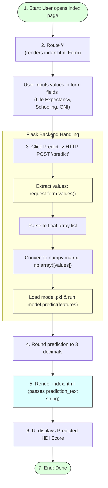

# Writing the Flask Backend

## Task Overview

After training and saving the Linear Regression model, the next step is to build the backend of the **Human Development Index (HDI) Prediction System** using the Flask framework. The Flask backend acts as the bridge between the user interface and the machine learning model.

The application loads the previously saved **Pickle (.pkl)** model, accepts user inputs through a web form, processes the input values, generates HDI predictions using the trained model, and displays the predicted HDI score on the web page.

---

# Objective

* Build the Flask backend application.
* Load the trained HDI prediction model.
* Define application routes.
* Accept user input from the web interface.
* Generate HDI predictions.
* Display prediction results.

---

# Flask Backend & Request-Response Lifecycle



---

# Libraries Used

The following libraries are required:

```python
from flask import Flask, render_template, request
import pickle
import numpy as np
```

### Purpose:
* **Flask** – Creates and manages the web application routing structure.
* **render_template** – Renders HTML pages with dynamic backend parameters.
* **request** – Retrieves user input submitted through HTTP forms.
* **Pickle** – Loads the saved machine learning model.
* **NumPy** – Converts user inputs into numerical arrays.

---

# Implementation Steps

## Step 1: Initialize the Flask Application
```python
app = Flask(__name__)
```
This creates an instance of the Flask application class.

## Step 2: Load the Trained Model
```python
# Load the serialized model binary in read binary (rb) mode
model = pickle.load(open("Model/model.pkl", "rb"))
```
The saved Linear Regression model is loaded into memory and becomes available for prediction.

## Step 3: Define the Home Route
The home route displays the application's main page.
```python
@app.route("/")
def home():
    # Renders the template with the input form fields
    return render_template("index.html")
```
The `index.html` page introduces the Human Development Index Prediction System and shows the form template.

## Step 4: Define the Prediction Route
The `/predict` route receives user input through an HTML form, converts it into numerical format, and predicts the HDI score.
```python
@app.route("/predict", methods=["POST"])
def predict():
    # Convert form inputs to floats list
    values = [float(x) for x in request.form.values()]
    
    # Format array structure to fit model expectations
    features = np.array([values])
    
    # Run prediction queries
    prediction = model.predict(features)
    
    # Render page while passing prediction result string context
    return render_template(
        "index.html",
        prediction_text=f"Predicted HDI Score: {round(prediction[0], 3)}"
    )
```

## Step 5: Run the Flask Application
```python
if __name__ == "__main__":
    app.run(debug=True)
```
The Flask development server starts and hosts the web application locally.

---

# Backend Workflow

1. User opens website.
2. Home template rendered.
3. User enters HDI inputs in form.
4. HTTP POST request sent to `/predict`.
5. Flask backend extracts inputs.
6. Pickle model loaded and executed.
7. Predicted HDI score displayed in browser view.

---

# Expected Outcome

The Flask backend successfully accepts user input, loads the trained Linear Regression model, predicts the Human Development Index score, and displays the result through the web interface.

---

# Result

The Flask backend was successfully implemented. The application correctly loads the saved HDI prediction model, processes user inputs, generates predictions, and displays the predicted HDI score on the web page.

---

# Conclusion

The Flask backend forms the core of the deployed HDI Prediction System by connecting the user interface with the trained machine learning model. It enables real-time prediction of HDI scores based on user-provided development indicators, making the application interactive and practical.
