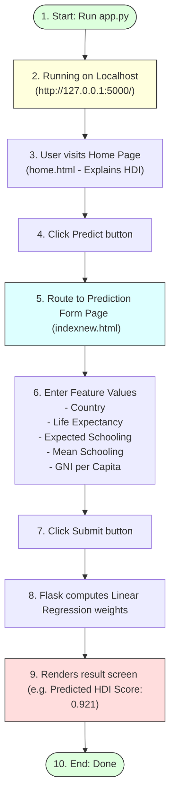

# Running the Application

## Task Overview

After developing the Flask backend and integrating the trained Linear Regression model, the final step is to run the Human Development Index (HDI) Prediction System. The application is executed using the Flask development server, allowing users to interact with the web interface and generate HDI predictions based on the input values they provide.

The web application consists of multiple pages that guide users through the prediction process. Users can learn about the Human Development Index, navigate to the prediction page, enter development indicators, and receive an estimated HDI score generated by the trained machine learning model.

---

# Objective

* Run the Flask web application.
* Verify successful model integration.
* Test user input functionality.
* Generate HDI predictions.
* Display prediction results on the web interface.

---

# User Interaction & Navigation Flow



---

# Application Pages Description

## 1. Home Page (`home.html`)
The **Home Page** serves as the landing page of the application.

### Features:
* Brief introduction to the Human Development Index (HDI).
* Explains the purpose of the prediction system.
* Simple and user-friendly interface.
* **Predict** button placed at the top-right corner.
* Navigates users to the prediction page.

---

## 2. Prediction Page (`indexnew.html`)
The prediction page allows users to enter the required information for HDI prediction.

### User Inputs:
* Country
* Life Expectancy
* Expected Years of Schooling
* Mean Years of Schooling
* Gross National Income (GNI) per Capita
* Other required development indicators (if applicable)

Each field accepts values within valid ranges to ensure meaningful predictions.

After entering all values, the user clicks the **Predict** button to submit the form.

---

## 3. Prediction Result
After submission:
* The entered values are sent to the Flask backend.
* The saved Linear Regression model processes the inputs.
* The predicted HDI score is calculated.
* The result is displayed on the web page in a readable format.

Example:
```
Predicted HDI Score : 0.921
```

---

# Running the Application

Open the project folder in your command terminal and execute:

```bash
python app.py
```

Flask starts the development server.

Example Output:
```
* Serving Flask app 'app'
* Debug mode: on
* Running on http://127.0.0.1:5000/ (Press CTRL+C to quit)
```

Open the URL `http://127.0.0.1:5000/` in any web browser.

---

# Application Workflow

1. Start Flask Server.
2. Open Browser.
3. Home Page (`home.html`).
4. Click Predict.
5. Prediction Page (`indexnew.html`).
6. Enter HDI Inputs.
7. Submit Form.
8. Flask Backend.
9. Load Saved Model.
10. Generate Prediction.
11. Display Predicted HDI Score.

---

# Testing the Application

The application was tested by entering different combinations of input values.

Verification included:
* Home page loading successfully.
* Navigation to the prediction page.
* User input validation.
* Successful prediction generation.
* Correct display of the predicted HDI score.
* Smooth interaction between frontend and backend.

---

# Expected Outcome

The Flask application runs successfully and provides an interactive interface where users can enter HDI indicators and instantly receive predicted Human Development Index scores.

---

# Result

The Human Development Index Prediction System was successfully executed using Flask. The application correctly accepted user inputs, processed them through the trained Linear Regression model, and displayed accurate HDI predictions through the web interface.

---

# Conclusion

Running the Flask application marks the successful deployment of the HDI Prediction System. The completed application demonstrates the integration of machine learning with web development, enabling users to interactively predict Human Development Index scores based on real-world socio-economic indicators.
