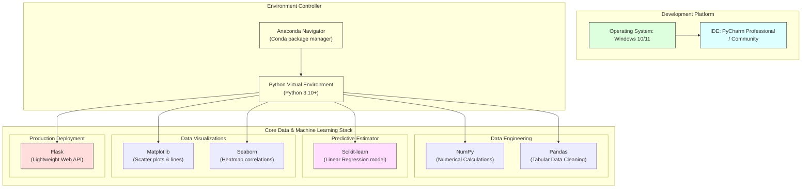

# Pre-requisites – Project Links

## Task Overview

This task introduces the software tools, Python libraries, and development environments required to build the **A Comprehensive Measure of Well-Being (HDI Prediction System)**. These tools support every stage of the project, including data preprocessing, visualization, machine learning model development, and web application deployment.

Installing these resources before starting the project ensures a smooth development workflow and compatibility between different project components.

---

# Objective

* Identify the software and libraries required for the project.
* Provide official download and documentation links.
* Prepare the development environment for machine learning model development.
* Ensure all required dependencies are available before implementation.

---

# Environment & Technology Stack Diagram

---

# Required Software and Libraries

## 1. Anaconda Navigator

**Purpose**

Anaconda Navigator is a graphical interface that simplifies Python package management, environment creation, and launching data science applications.

**Features**
* Python environment management
* Package installation
* Jupyter Notebook support
* Conda package manager
* Easy dependency management

**Official Download Link**

https://www.anaconda.com/download

---

## 2. PyCharm IDE

**Purpose**

PyCharm is a professional Python Integrated Development Environment (IDE) used for writing, debugging, and testing Python applications.

**Features**
* Intelligent code completion
* Debugging tools
* Project management
* Version control integration
* Flask development support

**Official Link**

https://www.jetbrains.com/pycharm/

---

## 3. NumPy

**Purpose**

NumPy provides efficient numerical computing capabilities using multi-dimensional arrays and mathematical functions.

**Uses in this Project**
* Numerical computations
* Array operations
* Mathematical calculations
* Data preprocessing

**Official Documentation Link**

https://numpy.org/doc/stable/

---

## 4. Pandas

**Purpose**

Pandas is used for loading, cleaning, filtering, and manipulating structured datasets.

**Uses in this Project**
* Reading CSV files
* Handling missing values
* Data analysis
* Feature selection

**Official Documentation Link**

https://pandas.pydata.org/docs/

---

## 5. Scikit-learn

**Purpose**

Scikit-learn provides machine learning algorithms and evaluation tools.

**Uses in this Project**
* Linear Regression algorithm
* Train-Test Split partition logic
* Model training (`fit()`)
* Model prediction (`predict()`)
* Performance metrics evaluation

**Official Documentation Link**

https://scikit-learn.org/stable/

---

## 6. Matplotlib

**Purpose**

Matplotlib is used to create graphs and charts for exploratory data analysis.

**Uses in this Project**
* Scatter plots
* Histograms
* Line graphs
* Feature visualization

**Official Documentation Link**

https://matplotlib.org/stable/

---

## 7. Seaborn

**Purpose**

Seaborn builds on Matplotlib and provides attractive statistical visualizations.

**Uses in this Project**
* Correlation heatmaps
* Distribution plots
* Pair plots
* Regression plots

**Official Documentation Link**

https://seaborn.pydata.org/

---

## 8. Flask

**Purpose**

Flask is a lightweight Python web framework used to deploy the trained HDI prediction model as a web application.

**Uses in this Project**
* Backend development
* User input routing handling
* Model prediction integration
* HTML template rendering

**Official Documentation Link**

https://flask.palletsprojects.com/

---

# Development Workflow

1. Install Anaconda Navigator.
2. Create a Python environment.
3. Install PyCharm IDE.
4. Install required Python libraries.
5. Load the dataset.
6. Train the Linear Regression model.
7. Save the trained model.
8. Build the Flask application.
9. Deploy and test the application.

---

# Expected Outcome

A fully configured development environment with all required software and Python libraries installed successfully, enabling smooth implementation of the HDI Prediction System.

---

# Result

All necessary software tools and libraries were successfully identified and documented. These resources provide the complete development environment required for data preprocessing, machine learning model development, visualization, and Flask-based deployment.

---

# Conclusion

The selected software tools and Python libraries form the backbone of the HDI Prediction System. Together, they enable efficient data analysis, machine learning model training, visualization, and deployment, ensuring a reliable and scalable development process.
