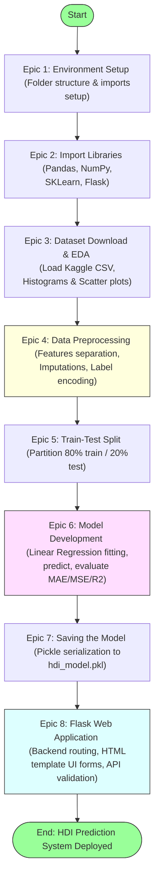

# Project Workflow

## Task Overview

The **A Comprehensive Measure of Well-Being (HDI Prediction System)** follows a structured Machine Learning workflow that covers every stage of the project lifecycle, from environment setup to model deployment. Dividing the project into multiple epics ensures organized development, easier maintenance, and systematic implementation of each component.

The workflow includes environment preparation, dataset analysis, preprocessing, model development, evaluation, model serialization, and deployment using a Flask web application.

---

# Objective

* Define the complete development workflow of the project.
* Organize the implementation into logical phases (Epics).
* Ensure systematic execution of each machine learning task.
* Simplify project development, testing, and deployment.

---

# Project Workflow Pipeline Diagram



---

# Epic 1: Environment Setup and Package Installation

### Story 1: Install Required Packages
Install all required software, Python packages, and machine learning libraries.
* **Packages:**
  * NumPy
  * Pandas
  * Matplotlib
  * Seaborn
  * Scikit-learn
  * Flask
  * Pickle

### Story 2: Project Folder Structure
Create a well-organized project structure.
```
HDI-Prediction/
│
├── Dataset/          # Contains raw and preprocessed CSV files
├── Model/            # Contains serialized pickle binaries (hdi_model.pkl)
├── Static/           # Static assets (CSS, JS, images)
├── Templates/        # HTML templates for user frontend views
├── Images/           # Plots exported during EDA
├── app.py            # Flask backend controller script
├── model.py          # Machine learning model training script
├── requirements.txt  # Dependencies list
└── README.md         # Documentation summary file
```

---

# Epic 2: Importing Required Libraries

Import all required Python libraries for data processing, visualization, machine learning, and deployment.
* **Libraries:**
  * NumPy & Pandas
  * Matplotlib & Seaborn
  * Scikit-learn
  * Pickle
  * Flask

---

# Epic 3: Dataset Download and Understanding

### Story 1
Download the Human Development Index dataset from Kaggle.

### Story 2
Load the dataset into the Python environment and understand:
* Number of records
* Features
* Target variable
* Data types
* Statistical summary

### Story 3
Perform Exploratory Data Analysis (EDA) using visualizations. Common visualizations include:
* Histograms
* Scatter Plots
* Correlation Heatmaps
* Pair Plots
* Distribution Graphs

---

# Epic 4: Data Preprocessing and Label Encoding

### Story 1
Select:
* Independent Variables (Features)
* Dependent Variable (Target)

### Story 2
Check for:
* Missing values
* Duplicate records
* Invalid entries
Handle missing values appropriately (imputations).

### Story 3
Apply Label Encoding wherever categorical data is present to map values to numerical equivalents.

### Story 4
Prepare the cleaned dataset for machine learning.

---

# Epic 5: Train-Test Split

Split the processed dataset into:
* Training Dataset
* Testing Dataset

Typical ratio:
* 80% Training
* 20% Testing

This allows the model to learn from one portion of the data while being evaluated on unseen data.

---

# Epic 6: Model Development

### Story 1
Train the Linear Regression model using the training dataset.

### Story 2
Generate predictions for the testing dataset.

### Story 3
Evaluate model performance using regression metrics such as:
* Mean Absolute Error (MAE)
* Mean Squared Error (MSE)
* Root Mean Squared Error (RMSE)
* R² Score
Visualize prediction performance using regression plots.

---

# Epic 7: Saving the Model

### Story 1
Serialize the trained model using Pickle.

### Story 2
Store the generated model file for future predictions without retraining.
* **Example output:** `models/hdi_model.pkl`

---

# Epic 8: Flask Web Application

### Story 1: Develop the Flask backend
* **Responsibilities include:**
  * Loading the trained model
  * Accepting user inputs
  * Processing prediction requests
  * Returning prediction results

### Story 2: Design HTML templates for user interaction
* **Typical pages include:**
  * Home Page
  * Prediction Form
  * Result Page

### Story 3: Run and Test
Run and test the web application to verify prediction accuracy and application functionality.

---

# Workflow Summary

1. Environment Setup
2. Import Libraries
3. Download Dataset
4. Understand Dataset
5. Data Visualization
6. Data Preprocessing
7. Train-Test Split
8. Train Linear Regression Model
9. Predict Results
10. Evaluate Model
11. Save Model
12. Build Flask Application
13. Deploy and Test

---

# Expected Outcome

A structured and organized workflow that guides the complete development of the HDI Prediction System from dataset preparation to deployment.

---

# Result

The project workflow was successfully designed by dividing the implementation into eight well-defined epics. Each phase contributes to the successful development, evaluation, and deployment of the HDI Prediction System.

---

# Conclusion

A structured workflow improves project organization, reduces development complexity, and ensures every stage of the machine learning lifecycle is completed systematically. Following this workflow results in a reliable, maintainable, and scalable HDI Prediction System capable of providing accurate human development predictions.
